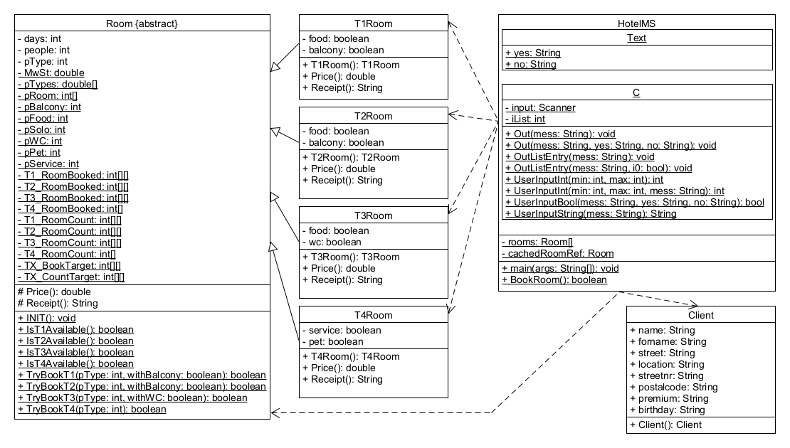

# HotelMS

Das ganze ist im Rahmen einer Projektarbeit für das Modul Programmieren entstanden. Die Repo soll veranschaulichen wie ich eine Aufgabe direkt Umsetzen würde und auch wie mein Coding Style ist.
Sowas könnte sinnvoll sein hochzuladen, dachte ich, weil der Rest aktuell Hobbyzeugs ist.

Es sind hier nur die Java Klassendateien hinterlegt. Die gesamte komplexe Ordner Struktur von Java hochzuladen fiel mir zu lächerlich; ist auch glaub ich nicht relevant.

UML Diagramm zum Programm

